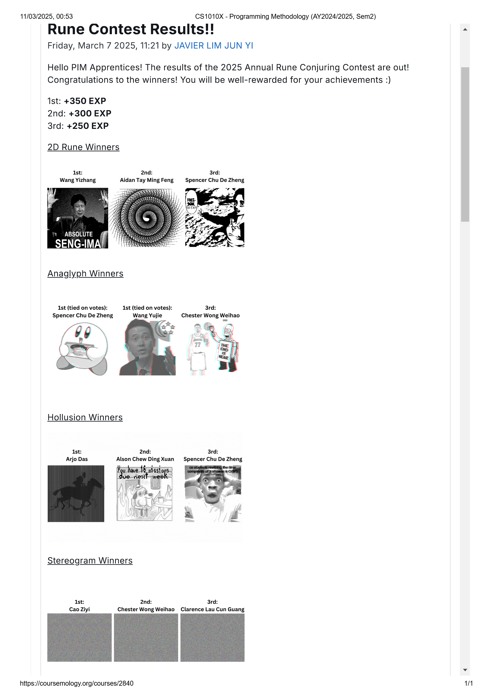

# 

## Files Overview  

The project consists of five main scripts:  
**`convert_binary.py`** – Converts a color image into a grayscale pixel array and saves it as a text file.  
**`contest02.2-template.py`** – Reads the pixel array and converts it into a **rune-based visualization** using the `runes` library.  
**`runes.py, graphics.py, PyGif.py`** – Default scripts as given by the contest.  

This project is particularly useful for **creative coding, image transformation, and visual representation using functional programming concepts**.  
